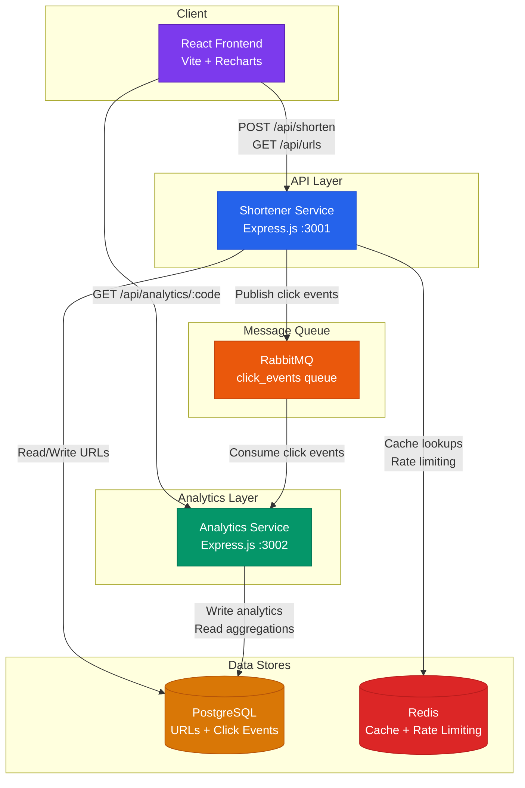

# SnipLink — Cloud-Native URL Shortener Platform

A production-grade, microservices-based URL shortener with click analytics, built for cloud-native deployment on Kubernetes with full CI/CD and observability.

## Architecture



## Flow

1. **User creates a short URL** → Frontend calls `POST /api/shorten` → Shortener generates a nanoid code, stores in Postgres, returns the short URL
2. **Someone clicks a short URL** → `GET /:code` → Shortener looks up Redis cache (Postgres fallback), issues 302 redirect, publishes a click event to RabbitMQ
3. **Analytics processes clicks** → Analytics service consumes events from RabbitMQ, inserts into `click_events` table
4. **User views analytics** → Frontend calls Analytics API → Aggregated stats (clicks over time, top referrers) rendered as charts

## Tech Stack

| Component | Technology | Purpose |
|---|---|---|
| Shortener API | Node.js + Express | URL creation, redirect, rate limiting |
| Analytics API | Node.js + Express | Click event processing, aggregation queries |
| Frontend | React + Vite | SPA for link management + analytics dashboard |
| Database | PostgreSQL 16 | Persistent storage for URLs + click events |
| Cache | Redis 7 | URL lookup caching + rate limit sliding window |
| Message Queue | RabbitMQ 3.13 | Async click event pipeline (shortener → analytics) |
| Charts | Recharts | Analytics visualizations |

## Project Structure

```
url-shortener/
├── services/
│   ├── shortener/        # URL shortener microservice
│   │   └── src/
│   └── analytics/        # Click analytics microservice
│       └── src/
├── frontend/             # React SPA (Vite)
│   └── src/
├── infra/                # Docker Compose, infra configs
├── k8s/                  # Kubernetes manifests (Phase 3)
├── load-testing/         # k6 load test scripts (Phase 6)
├── docs/                 # Architecture & design docs
├── .github/workflows/    # CI/CD pipelines (Phase 4)
└── docker-compose.infra.yml
```

## Quick Start

### Prerequisites
- Node.js 18+
- PostgreSQL 16 running on port 5432
- Redis 7 running on port 6379
- RabbitMQ 3.13 running on port 5672

### Setup

```bash
# 1. Create the database
psql -U postgres -c "CREATE DATABASE urlshortener;"

# 2. Start the shortener service
cd services/shortener
cp .env.example .env
npm install
npm run dev          # → http://localhost:3001

# 3. Start the analytics service (new terminal)
cd services/analytics
cp .env.example .env
npm install
npm run dev          # → http://localhost:3002

# 4. Start the frontend (new terminal)
cd frontend
cp .env.example .env
npm install
npm run dev          # → http://localhost:5173
```

### Docker Compose (Full Stack)

Run all 6 services (Shortener, Analytics, React SPA + Nginx, PostgreSQL, Redis, RabbitMQ) in containers:

```bash
# Build and start all services in detached mode
docker compose up --build -d

# View status of containers and health checks
docker compose ps

# Follow logs across all services
docker compose logs -f

# Stop and remove containers
docker compose down
```

### Kubernetes & Helm Deployment (Cloud-Native)

Deploy the entire stack with declarative K8s manifests or Helm:

```bash
# Option A: Single command with Kustomize
kubectl apply -k k8s/

# Option B: Parameterized deployment with Helm
helm upgrade --install sniplink helm/sniplink --namespace sniplink --create-namespace

# Check Pods, Services, and HPAs:
kubectl get all -n sniplink
kubectl get hpa -n sniplink
```

### Automated Testing & CI/CD

Run unit tests locally across microservices:

```bash
# Test shortener microservice
cd services/shortener && npm test

# Test analytics microservice
cd services/analytics && npm test

# Test frontend build
cd frontend && npm run build
```

The GitHub Actions workflow (`.github/workflows/ci-cd.yml`) automatically triggers on push and pull requests, executing:
1. **Parallelized Unit Tests** across microservices
2. **Frontend Compilation & Asset Validation**
3. **K8s & Helm Chart Linting**
4. **Multi-Stage Docker Image Builds** with layer caching (`type=gha`)
5. **Helm Package Artifact Archival**

### Observability (Prometheus & Grafana)

The platform is instrumented with **Prometheus RED metrics** and pre-configured **Grafana dashboards**:

- **Prometheus UI**: [http://localhost:9090](http://localhost:9090)
  - Scrapes metrics from `shortener:3001/metrics`, `analytics:3002/metrics`, and RabbitMQ exporter (`:15692`)
- **Grafana Dashboard**: [http://localhost:3000](http://localhost:3000) (`admin` / `admin`)
  - Auto-provisions the **"SnipLink Platform Overview"** telemetry dashboard:
    - **Throughput (RPS)** per microservice
    - **P50, P95 & P99 Request Latency** histograms
    - **HTTP 4xx / 5xx Error Rates**
    - **Redis Read-Through Cache Hit Ratio (%)**
    - **RabbitMQ Message Ingestion & Processing Rate**
    - **Node.js Process Heap Memory & Event Loop Lag**

### Load Testing & Performance Benchmarking (k6)

The platform includes a performance testing suite built with **Grafana k6** and high-concurrency Node generators:

```bash
# Option A: Run via PowerShell test runner (using local k6 binary)
.\load-testing\run-k6.ps1 -Test smoke   # Quick 1-VU connectivity baseline
.\load-testing\run-k6.ps1 -Test load    # Production 50-VU traffic simulation (80% redirects, 15% shorten, 5% stats)
.\load-testing\run-k6.ps1 -Test stress  # 250-VU traffic spike & rate limiter stress test
.\load-testing\run-k6.ps1 -Test soak    # 2-minute endurance & memory stability test

# Option B: Run standalone zero-dependency Node.js concurrency benchmark
node .\load-testing\benchmark-node.js
```

### Test it

```bash
# Create a short URL
curl -X POST http://localhost:3001/api/shorten \
  -H "Content-Type: application/json" \
  -d '{"url": "https://github.com"}'

# Visit the short URL (will redirect)
curl -L http://localhost:3001/<shortCode>

# Check analytics
curl http://localhost:3002/api/analytics/<shortCode>

# View live Prometheus metrics
curl http://localhost:3001/metrics
```

## What This Demonstrates

*Reference these for CV bullets:*

- **Microservices architecture** — Independently deployable services communicating via async message queue
- **Event-driven design** — RabbitMQ-based click event pipeline decoupling write-heavy analytics from latency-sensitive redirects
- **Containerization & multi-stage builds** — Alpine-based production images running as non-root users with layer caching and Nginx SPA optimization
- **Container orchestration (Kubernetes & Helm)** — Production K8s manifests with HPA (CPU/Memory scaling), declarative PVCs, Nginx Ingress routing, and parameterized Helm 3 chart
- **CI/CD pipeline (GitHub Actions)** — Multi-stage matrix pipeline with automated unit testing, static analysis, Docker buildx layer caching, and Helm packaging
- **Cloud observability (Prometheus & Grafana)** — Standardized RED metrics, custom business counters, auto-provisioned dashboards, and RabbitMQ telemetry
- **Performance engineering & load testing (k6)** — High-concurrency traffic simulation, latency SLA validation (P95 < 80ms), rate limiting resilience, and autoscaling trigger verification
- **Caching strategy** — Redis as a read-through cache for URL lookups, reducing Postgres load on the hot path
- **Rate limiting** — Redis-backed sliding window rate limiter protecting the API from abuse
- **Cloud-native patterns** — Health check endpoints, environment-based configuration, stateless services

## Phases

- [x] **Phase 1** — Repo scaffolding & local services
- [x] **Phase 2** — Dockerize (multi-stage builds, docker-compose full stack)
- [x] **Phase 3** — Kubernetes (manifests, Helm chart, Ingress, HPA)
- [x] **Phase 4** — CI/CD (GitHub Actions)
- [x] **Phase 5** — Observability (Prometheus, Grafana, Loki)
- [x] **Phase 6** — Load testing & autoscaling proof

## License

MIT


